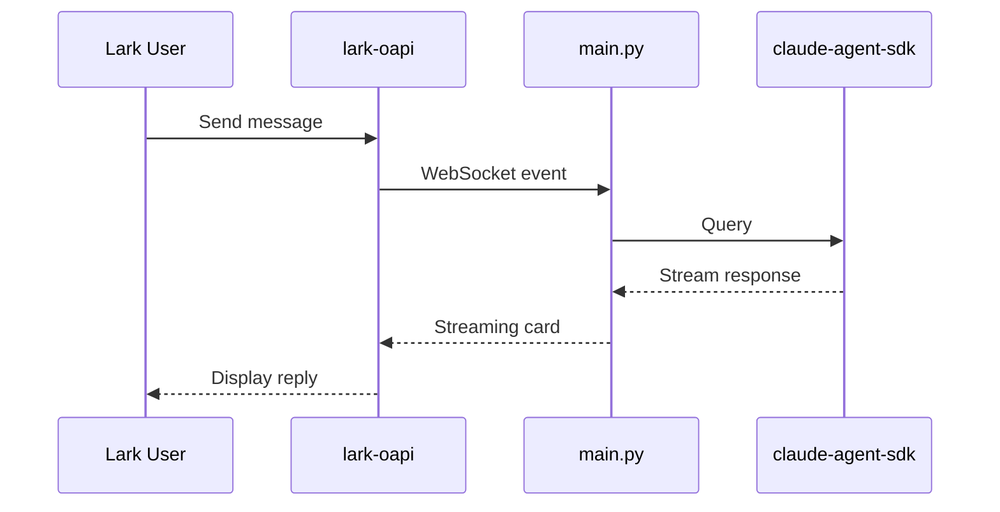

# Lark Claude Agent

A Claude agent that integrates with Lark (Feishu).

## Features

- Bidirectional messaging via WebSocket
- Streaming card replies with typing effect
- Text, image, file, and rich text support

## Architecture



## Prerequisites

1. Create a Lark app at [Feishu Open Platform](https://open.feishu.cn/app)
2. Enable required permissions:
   - `im:message` - Send and receive messages
   - `im:resource` - Download images and files
3. Enable WebSocket in app settings

See [Lark Bot Development Guide](https://open.feishu.cn/document/develop-an-echo-bot/introduction) for details.

## Setup

1. Install dependencies:
   ```bash
   uv sync
   ```

2. Copy `.env.example` to `.env` and fill in your credentials:
   ```bash
   cp .env.example .env
   ```
   ```env
   ANTHROPIC_API_KEY=sk-xxx
   LARK_APP_ID=cli_xxx
   LARK_APP_SECRET=xxx
   LARK_OPEN_ID=ou_xxx  # Optional, for @mention filtering
   ```

3. Run the agent:
   ```bash
   uv run python main.py
   ```
