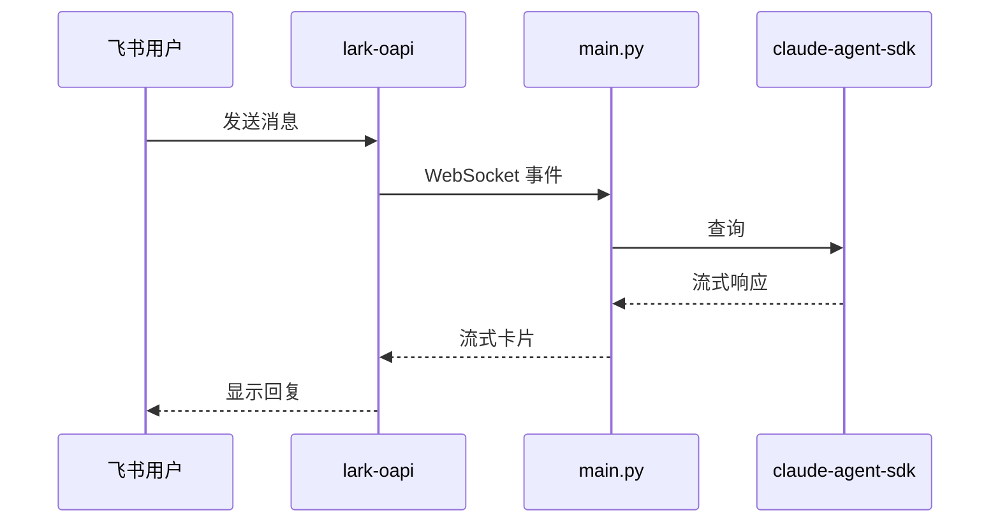

# Lark Claude Agent

[English](README.md) | 中文

一个与飞书集成的 Claude 智能体。

## 功能特性

- 支持文本、图片、文件和富文本消息
- 理解被回复消息的上下文
- 流式卡片回复，带打字效果

## 架构



## 前置条件

1. 在[飞书开放平台](https://open.feishu.cn/app)创建应用
2. 启用所需权限：
   - `im:message` - 发送和接收消息
   - `im:resource` - 下载图片和文件
3. 在应用设置中启用 WebSocket

详情请参阅[飞书机器人开发指南](https://open.feishu.cn/document/develop-an-echo-bot/introduction)。

## 安装配置

1. 安装依赖：
   ```bash
   uv sync
   ```

2. 复制 `.env.example` 为 `.env` 并填写凭据：
   ```bash
   cp .env.example .env
   ```
   ```env
   ANTHROPIC_API_KEY=sk-xxx
   LARK_APP_ID=cli_xxx
   LARK_APP_SECRET=xxx
   LARK_OPEN_ID=ou_xxx  # 可选，用于 @提及 过滤
   ```

3. 运行智能体：
   ```bash
   uv run python main.py
   ```
